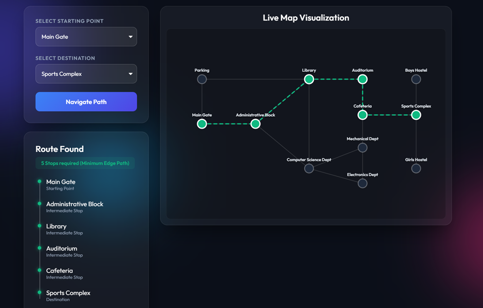
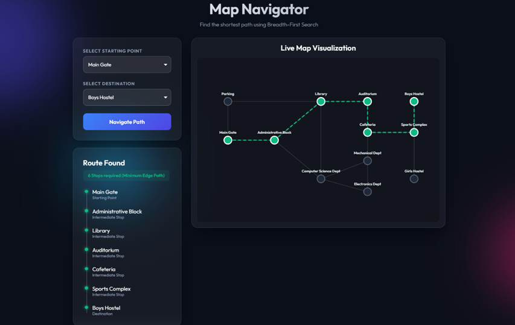

# DSA Map Navigator Mini Project

## Overview
This project implements a Campus Map Navigator using Data Structures and Algorithms in C++ and integrates frontend and backend using API.

The system finds the shortest path between locations in an unweighted campus graph using Breadth-First Search (BFS).

## Technologies Used
- C++
- Python (Flask)
- HTML
- JavaScript

## Features
- Campus map navigation
- Shortest path using BFS
- Frontend-backend integration using API
- JSON data exchange
- Route visualization

## Project Structure
```text
backend/    -> C++ DSA logic
api/        -> Flask API
frontend/   -> HTML and JavaScript
```

## Algorithm Used
- Graph Representation (Adjacency List)
- Breadth-First Search (BFS)

## How to Run
1. Compile the C++ program:
```bash
g++ map_navigator.cpp -o map_navigator
```

2. Run the Flask API:
```bash
python app.py
```

3. Open in browser:
```text
http://127.0.0.1:5000
```

## Sample Output
Example Path:

```text
Main Gate -> Administrative Block -> Library -> Auditorium -> Cafeteria -> Sports Complex
```





## Author
Smarth Sharma 2026
